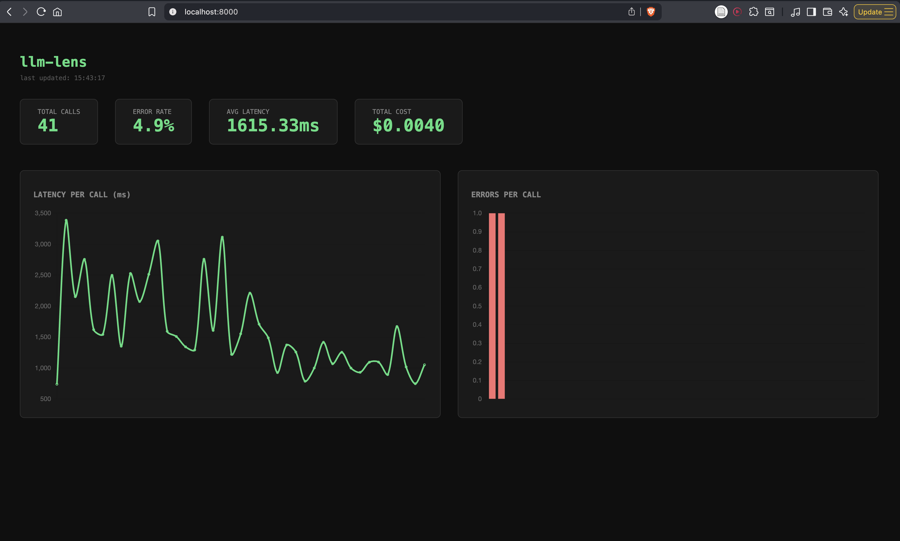

# llm-lens

Automatic observability for OpenAI and Anthropic API calls.  
Tracks latency, token usage, cost, and errors — with a live web dashboard.

[](https://pypi.org/project/llm-lens-py/)
[](https://pypi.org/project/llm-lens-py/)
[](https://opensource.org/licenses/MIT)



---

## What it does

Add one import to your project. llm-lens silently intercepts every OpenAI and Anthropic API call and logs:

- Latency (ms)
- Input and output tokens
- Cost in USD
- Model used
- Errors and status

No SDK changes. No account setup. No config files.

---

## Installation

```bash
pip install llm-lens-py
```

---

## Usage

```python
import llm_lens        # patches OpenAI and Anthropic automatically
import openai

client = openai.OpenAI()
response = client.chat.completions.create(
    model="gpt-4o-mini",
    messages=[{"role": "user", "content": "hello"}]
)
# this call was silently tracked
```

Works the same way for Anthropic:

```python
import llm_lens
import anthropic

client = anthropic.Anthropic()
message = client.messages.create(
    model="claude-3-5-haiku-20241022",
    max_tokens=100,
    messages=[{"role": "user", "content": "hello"}]
)
# also tracked
```

---

## CLI

```bash
# show a rich table of all tracked calls
llm-lens

# show aggregated stats: total calls, error rate, avg latency, total cost
llm-lens stats

# start the live dashboard at http://localhost:8000
llm-lens serve

# set a cost alert threshold
llm-lens config set cost_alert_usd 0.10
```

---

## Dashboard

Run `llm-lens serve` and open `http://localhost:8000`.

- Live stats: total calls, error rate, avg latency, total cost
- Latency per call chart
- Error per call chart (red/green color coded)
- Red alert banner when cost threshold is breached
- Auto-refreshes every 5 seconds

---

## How it works

llm-lens uses Python monkey-patching to intercept API calls at runtime without touching your code.

```
client.chat.completions.create(...)
  → llm-lens wrapper intercepts
  → measures latency with time.perf_counter()
  → calls the original SDK
  → extracts tokens, model, cost
  → writes to ~/.llm_lens/calls.db
  → returns original response unchanged
```

---

## Supported models

| Provider  | Models |
|-----------|--------|
| OpenAI    | gpt-4o, gpt-4o-mini, gpt-4-turbo |
| Anthropic | claude-3-5-sonnet, claude-3-5-haiku, claude-3-opus |

Fuzzy model matching handles version suffixes automatically (e.g. `gpt-4o-2024-08-06`).

---

## Data storage

All data is stored locally at `~/.llm_lens/calls.db` (SQLite). Nothing leaves your machine unless you deploy the server yourself.

| Column | Description |
|--------|-------------|
| `latency_ms` | End-to-end latency in milliseconds |
| `input_tokens` | Prompt tokens |
| `output_tokens` | Completion tokens |
| `cost_usd` | Calculated cost in USD (8 decimal precision) |
| `model` | Model string returned by the API |
| `status` | `ok` or `error` |
| `timestamp` | UTC datetime |

---

## Docker

```bash
docker build -t llm-lens .
docker run -p 8000:8000 llm-lens
```

---

## Stack

Python · FastAPI · SQLite · Vanilla JS · Chart.js · Docker · Render

---

## Roadmap

- GitHub Actions CI (lint + tests)
- Per-model breakdown in dashboard
- Export to CSV endpoint
- Async / streaming support
- Slack or email alerts

---

## Contributing

Issues and PRs are welcome. The codebase is intentionally small — the core logic lives in `patch.py` and `core.py`.

```
src/llm_lens/
  __init__.py     # calls patch_all() on import
  patch.py        # monkey-patches OpenAI + Anthropic, pricing table
  core.py         # SQLite, get_records(), get_stats(), cost alerts
  cli.py          # CLI entry point
  server.py       # FastAPI backend
  dashboard.html  # single-file frontend with Chart.js
```

---

## Links

- [PyPI](https://pypi.org/project/llm-lens-py/)
- [Live demo](https://llm-lens.onrender.com) *(deploy your own instance to see live data)*
- [Medium article](https://medium.com/@adityas2804/i-built-my-own-llm-observability-tool-heres-why-and-how-6ea060562b98)

---

Built by [Aditya Sharma](https://github.com/AdityaSharma2804) · MIT License
